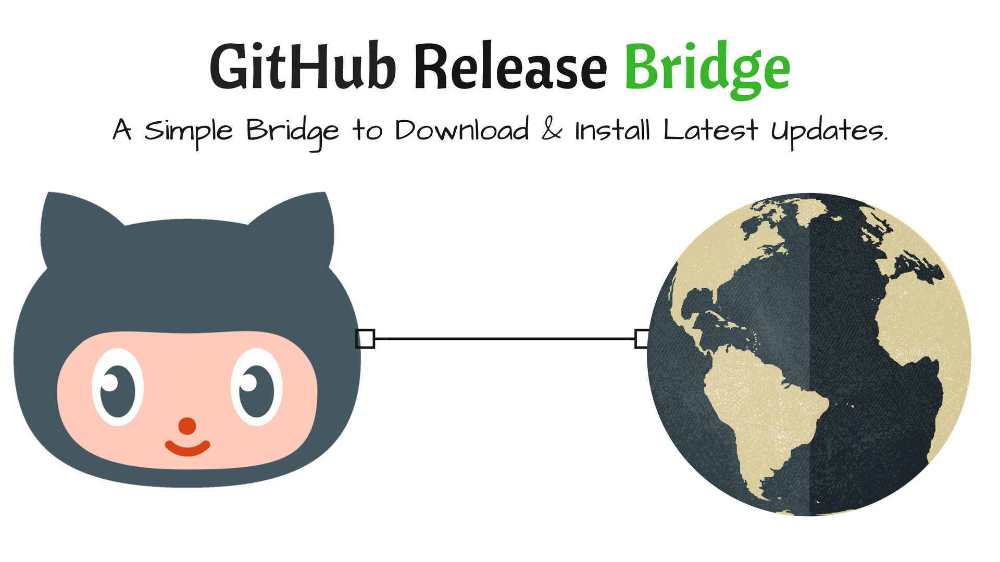

     

>A simple :octocat: Github Release Bridge to Download latest :cat: release and update them  Automatically :dog: , writen :black_nib:   
> in C++ using Qt5 :earth_americas: . Best suitable for your Qt :8ball: Project which requires Autoupdate on new release! :heart:   
> --Antony Jr.

# GitHub Release Bridge     

Have you ever wanted to **AutoUpdate** your app when you just **make a new release on github** ? Well , **GHReleaseBridge**   
just does that! This Project was created for the same purpose as **[QInstallerBridge](https://github.com/antony-jr/QInstallerBridge)**  , This small **header** simply Download's the latest release from your configured repo and updates them **Automatically to all users**  who have **installed your app**, writen in C++ using Qt5. Best suitable for your **Qt Projects** which **requires Autoupdate on new release!** :heart:   

**Note:** This can be used for all projects that uses **GitHub** as the deployment platform. Not limited to **C++**.

# Getting Started

Learn more about **GitHub Release Bridge** at the official [GitHub Release Bridge Documentation](https://antony-jr.github.io/GHReleaseBridge)

# Thank You 

I really need to thank the developers of this libraries for creating it because GHReleaseBridge is elegant because of them! :heart:   

* [QArchive](https://github.com/antony-jr/QArchive)
* [QEasyDownloader](https://github.com/antony-jr/QEasyDownloader)
* [Qt](https://github.com/qt)

# Support  

If you think that this project is **cool** then you can give it a :star: or :fork_and_knife: it if you want to improve it with me. I really :heart: stars though!   

    

If you want to do something that stands out then you can click the **donate** button at the top to make a monthly donation , So   
I will make sure that I stay healthy and keep on to do my work. :briefcase: Supporting me means supporting all of my projects , So   
you are like **Tony Stark** :heart: who backs **Spider-Man**! Thank you for your extra care! :dog:   

You can also tweet about me on twitter , get connected with me [@antonyjr0](https://twitter.com/antonyjr0)

Thank You! :smiley_cat:

# License

The BSD 3-clause "New" or "Revised" License.

Copyright (C) 2017 , antony jr.   
All Rights Reserved.
